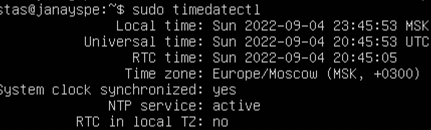
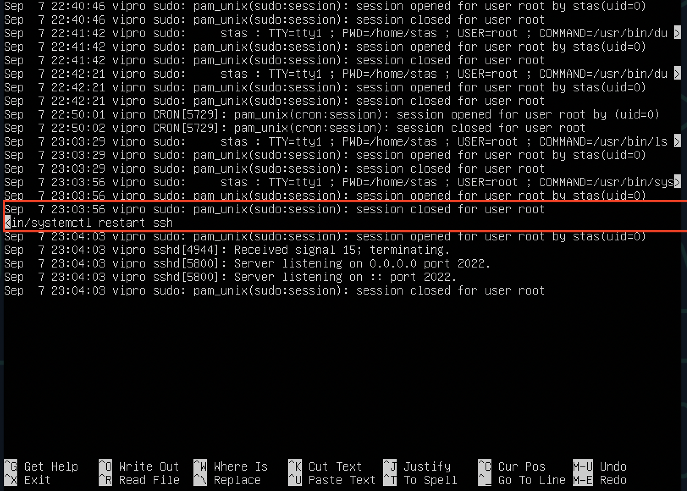

# Отчет

## 1. Установка ОС.
- 
- > Смотрим версию установленной ОС

## 2. Создание пользователя
- 
- > Создаем нового пользователя, добавиляем в adm
- 
- > Проверяем внеслись ли изменения

## 3. Настройка сети ОС
- 
- > Задаем название машины
- 
- > Устанавливаем временную зону
- 
- > Проверяем временную зону
- 
- > Вывод названий сетевых интерфейсов
- > lo - интерфейс обратной петли который позволяет компьютеру обращаться к самому себе. Интерфейс имеет адрес 127.0.0.1 и необходим для нормальной работы системы
- 
- > Получение адреса от DHCP-сервера
- > DHCP - (Dynamic Host Configuration Protocol) протокол динамической настройки узла, прикладной протокол, позволяющий сетевым устройствам автоматически получать IP-адрес и другие параметры, необходимые для работы.
- 
- > Внешний ip 10.0.2.15
- > gateway    10.0.2.2
- 
- > Задаем статичные настройки ip, gateway, dns
- 
- > Применяем настройки после чего делаем reboot
- 
- > Проверяем заданные вручную настройки
- 
- > Пингуем хосты

## 4. Обновление ОС
- 
- Проверка была ли обновлена система

## 5. Использование команды sudo
- 
- > Разрешение пользователю выполнять команду sudo
- > sudo - это утилита позволяющая пользователю запускать программы с привилегиями другой учетной записи как правило суперпользователя.
- 
- > Меняем имя машины от имени другого пользователя и сразу же проверяем поменялось ли оно

## 6. Установка и настройка службы времени
- 
- > Вывод времени и часового пояса
- 
- > Вывод который содержит NTPSSynchronized=yes

## 7. Установка и использование текстовых редакторов
- 
- > Для закрытия файла с сохранением изменений в Vim использовал :wq
- 
- > Для закрытия файла в Vim без сохранения изменений :q!
- 
- > Поиск слова в строке /
- 
- > :s для того чтобы заменить одну часть на другую
- > % перед s означает что поиск ведется по всему файлу
- > g в конце означает что поменяем все найденые подстроки
- 
- > Для закрытия файла с сохранением я использовал сочетание l.ctrl + X
- > Далее при запросе готов ли я сохранить изменения нажал y (Yes)
- > Далее можно поменять имя файла
- 
- > Чтобы выйти без сохранения нужно нажать l.ctrl + x
- > Далее нажать n (No)
- 
- > Чтобы найти подстроку используй l.ctrl + w
- 
- > Чтобы найти и заменить используй l.ctrl + \
- > Сначала вводи строку которую хочешь поменять
- > Потом на что поменять
- 
- > Потом подтверди изменения y (Yes)
- 
- > Для того чтобы выйти из emacs с сохранением
- > Нужно нажать l.ctrl + x , l.ctrl + c
- > Далее подтвердить что хочу сохранить буффер - y
- 
- > Для того чтобы выйти без сохранения из emacs
- > Нужно нажать l.ctrl + x, l.ctrl + c
- > Далее отвергнуть изменения - n
- > Далее подтвердить свое желание написав Yes≈
- 
- > Для того чтобы начать поиск по файлу в emacs
- > Нужно нажать l.ctrl + s
- > Ввести нужное слово для поиска
- 
- > Для того чтобы заменить текст в файле в emacs
- > Нужно нажать Opt+shift+x и ввести replace-string
- > Ввести нужное слово для поиска
- > Ввести нужное слово для замены

## 8. Установка и базовая настройка сервиса SSHD
- 
- > A - отвечает за вывод всех процессов
- > grep отфильтровывает нужный
- > Для установки службы использовал apt install
- > Для добавления в автозагрузку systemctl enable ssh
- 
- > Для перенастройки исправил файл /etc/ssh/sshd_config
- 
- > t - показывает tcp соединения
- > a - показывает все соединения
- > n - показывает числовые адреса вместо того чтобы разлешать конфликт имен

## 9. Установка и использование утилит top, htop
- 
- > Uptime 2:20 min
- > Авторизованных пользователей 1
- > Общая загрузка системы 0.0, 0.0, 0.0
- > Количество процессов 135
- > Загрузка CPU 0.1 - на запущенные пользователем процессы 
- > 0.0 - на системные процессы
- > Загрузка памяти - 312.3
- > Процесс который больше всего грузит процессор - 5277
- > Процесс который больше всего грузит память - 1
- 
- > htop PID
- 
- > htop PERCENT_CPU
- 
- > htop PERCENT_MEM
- 
- > htop TIME
- 
- > htop отфильтрофан для sshd
- 
- > С процессом syslog используя поиск
- 
- > С добавленным выводом hostname, clock, и uptime

## 10. Использование утилиты fdisk
- 
- > Название VBox HardDisk
- > Размер 8589934592
- > Секторов 16777216

## 11. Использование утилиты df
- 
- > Размер раздела 7379852 кбайт
- > Размер занятого пространства 2926776 кбайт
- > Размер свободного пространства 4056788 кбайт
- > Процент использования 42%
- 
- > Размер раздела 7,1 гбайт
- > Размер занятого пространства 2.8  гбайт
- > Размер свободного пространства 3.9 гбайт
- > Процент использования 42%
- > Тип файловой системы ext4

## 12. Использование утилиты du
- 
- > Запустил команду du
- 
- > Размер папки /home
- 
- > Размер папки /var
- 
- > Размер папки /var/log
- 
- > Вывод размера всех элементов папки /var/log

## 13. Установка и использование утилиты ncdu
- 
- > Вывод размера папки /home
- 
- > Размер папки /var
- 
- > Размер папки /var/log

## 14. Работа с системными журналами
- 
- > Открытый файл /var/log/dmesg
- 
- > Открытый файл /var/log/syslog
- 
- > Открытый файл /var/log/auth.log
- 
- > Пользователь stas залогинился в системе 6 сентября в 22:21:58 by Login
- 
- > Перезапуск службы sshd

## 15. Использование планировщика заданий CRON
- 
- > Успешно выполненные задачи
- 
- > список текущих заданий
- 
- > Вывод команды crontab -l после удаления задач
